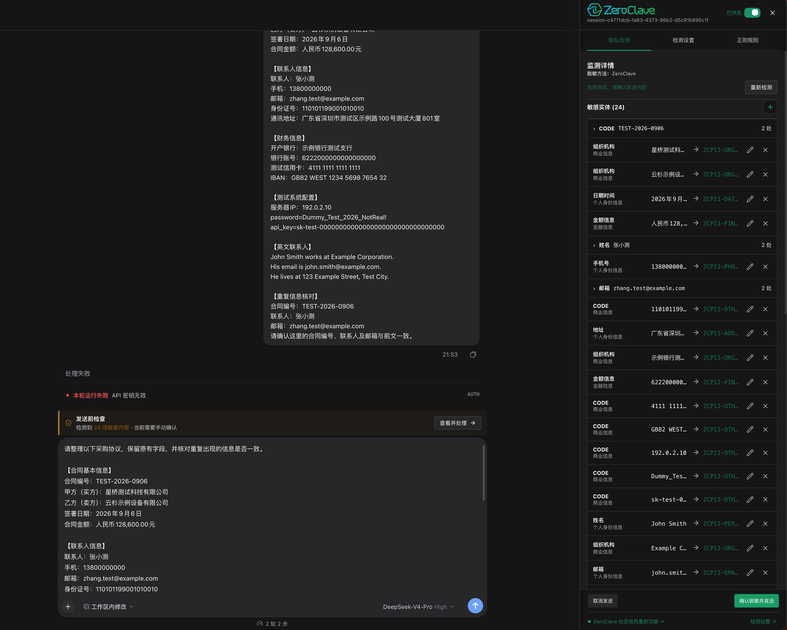

<a href="README.en.md">English</a> | 简体中文

  

<h1 align="center">ZeroClave Privacy Firewall</h1>

在消息发送给模型之前，发现敏感内容、查看脱敏结果，并决定如何发送。

  
  
  

  <a href="#快速开始">快速开始</a> ·
  <a href="https://deepseek.stream/plugins/zeroclave-dsh-privacy">插件主页</a> ·
  <a href="https://github.com/ZeroClave/zeroclave-dsh-privacy/blob/main/docs/DEVELOPMENT.md">开发文档</a> ·
  <a href="https://zeroclave.com/community">社区与微信群</a>

## 让隐私保护成为发送前的一步

粘贴合同、客户资料或配置片段时，邮箱、账号和密钥可能一起进入消息。ZeroClave 在 DeepSeek Harness 的消息发送流程中识别这些内容，让你先检查、调整，再继续发送。

- **先看再发**：原文高亮、敏感实体和脱敏输出，在同一个侧栏查看。
- **修改由你决定**：编辑替换内容、添加遗漏实体、取消或恢复保护；相同内容可批量处理。
- **两种发送策略**：默认手动确认，也可选择检测成功后自动脱敏发送。
- **失败可以继续**：检测失败或结果不完整时阻止发送，提供重试和明确切换本地正则的入口。
- **本地恢复显示**：模型回复保留替换标记时，可通过当前浏览器保存的映射恢复对应内容。

  

适用于 DeepSeek Harness **网页版和桌面版内嵌 Web 界面**。当前版本为 alpha，兼容 DSH `0.1.3-alpha.1` 与 `0.2.0-rc.2`。

## 快速开始

### 1. 获取安装包

从 [GitHub Releases](https://github.com/ZeroClave/zeroclave-dsh-privacy/releases) 下载发布包；开发构建可在 [Actions](https://github.com/ZeroClave/zeroclave-dsh-privacy/actions/workflows/ci.yml) 中选择成功的运行，再下载 **Artifacts**。

| 你要做什么 | 选择哪个文件 |
| --- | --- |
| 安装到自己的 DSH 桌面版或网页版 | `.tgz` |
| 发布到 DeepSeek Stream 插件市场 | `.zip` |

### 2. 在 DSH 中安装

打开 **插件 → 添加插件**，在 **包名或地址** 中粘贴 `.tgz` 文件的**绝对路径**，点击“安装”，完成后选择“立即启用”。

不需要先把本地包上传到 GitHub。若插件已经安装，升级时先卸载旧版，再安装新版。通过远程 Host 使用网页版时，路径必须指向 **Host 所在机器**上的文件。

> 本仓库包含可直接启动所需的最小编译产物 `lib/`，因此可以从 GitHub 源码安装并激活插件。桌面端如需可复现安装，建议使用带版本号的 `.tgz`；`.zip` 用于 DeepSeek Stream 插件市场上传。

### 3. 开启隐私检测

打开 ZeroClave 侧栏并开启检测，在“检测设置”中选择检测方式。初次体验可以选择**本地正则 + 手动确认**：无需下载模型，可以直接开始。

## 日常使用

1. **输入消息**：在 Harness 输入框中粘贴或编辑文本。
2. **查看与调整**：点击“查看详情”，或按发送进入同一侧栏。检查高亮内容与脱敏输出，按需编辑实体。
3. **确认发送**：保存修改后，点击“确认脱敏并发送”；取消则返回继续编辑。

同一草稿重新检测时保留人工选择；草稿文字改变后重新检测，避免把旧选择应用到新的内容。发送中会显示状态并阻止重复提交，失败时保留本次输入与修改供重试；草稿和附件的恢复由 Harness 管理。

<strong>需要少一步操作？切换到自动脱敏</strong>

在“检测设置 → 发送策略”中选择“自动脱敏”。检测成功后会使用脱敏内容继续发送，无需逐次打开确认面板；检测失败或不完整时仍会阻止发送。

## 选择适合你的检测方式

| 方式 | 适合什么内容 | 文本在哪里检测 |
| --- | --- | --- |
| **本地正则** | 结构化字段、账号、邮箱、手机号、合同编号和密钥 | 浏览器本地，不上传检测文本 |
| **浏览器 BERT** | 英文自然语言中的敏感实体 | 浏览器本地；首次使用下载模型 |
| **ZeroClave API** | 需要网关增强识别的内容 | 经 DSH Host 转发至 ZeroClave Gateway |

BERT 主要面向英文，中文合同建议优先使用本地正则。BERT 未加载或不可用时，需要加载模型或明确选择正则；ZeroClave 失败或返回不完整结果时，也不会静默放行。

## 你的数据如何处理

**检测范围是消息文本。** 图片、文件、音频、工具参数和附件元数据不在检测范围内。检测可能出现误报或漏报，发送前仍需核对。

- **选择本地检测**：正则和浏览器 BERT 不会将消息文本上传到检测服务。
- **选择 ZeroClave API**：DSH Host 与 Gateway 在检测阶段可见原文；这不是浏览器直达 TEE 的端到端加密通道。
- **选择保留原文**：被取消保护的内容会原样发送给模型，界面会明确提示。
- **恢复映射留在本机**：预览标记先保留在内存，确认发送时将恢复映射写入浏览器 IndexedDB。更换浏览器、设备或站点地址，以及清除浏览器数据，都可能使恢复不可用。
- **保护作用于常规消息发送**：直接 Host API、自动化脚本和输入框之外的发送路径，不在完整保护范围内。

<strong>关于“共享匿名使用统计”</strong>

当前发布配置默认开启统计能力；服务可用时会启用使用统计，你可以随时在“检测设置”中关闭“共享匿名使用统计”。浏览器的 Global Privacy Control（GPC）会强制关闭该选项。

统计关注检测是否执行、受保护请求是否成功发送，以及使用了哪种检测方式。统计事件不包含输入文本、命中内容、规则或会话内容；接收服务仍可能处理 IP 地址等连接信息。

## 一起改进 ZeroClave

欢迎通过 [Issues](https://github.com/ZeroClave/zeroclave-dsh-privacy/issues) 反馈误报、漏报和交互问题。请附上 DSH 版本、插件版本及可复现的合成示例，避免提交真实个人信息或密钥。

[开发与构建](https://github.com/ZeroClave/zeroclave-dsh-privacy/blob/main/docs/DEVELOPMENT.md) · [提交 Pull Request](https://github.com/ZeroClave/zeroclave-dsh-privacy/pulls) · [DeepSeek Stream](https://deepseek.stream/plugins/zeroclave-dsh-privacy)

  <strong>交流使用体验，获取版本动态</strong> 
  <a href="https://zeroclave.com/community">加入 ZeroClave 社区 · 获取微信群入口 →</a>

---

[Apache-2.0](https://github.com/ZeroClave/zeroclave-dsh-privacy/blob/main/LICENSE) · 内置 BERT 模型的许可证与使用限制以其模型卡为准。
